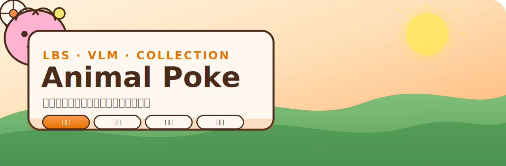

<p align="center">
  
</p>

<p align="center">
  
</p>

<h1 align="center">🐾 Animal Poke</h1>

<p align="center">
  <strong>走出门，用相机捕捉真实世界的小动物</strong><br/>
  LBS 探索 · 云端 VLM 识别 · 手账风图鉴 · 轻对战养成
</p>

<p align="center">
  <a href="#-核心循环"></a>
  <a href="#-技术栈"></a>
  <a href="#-安全原则"></a>
</p>

<p align="center">
  
  
  
  
  
  
  
</p>

<p align="center">
  <a href="docs/游戏开发计划.md">📖 设计文档</a> ·
  <a href="docs/openapi.yaml">🔌 OpenAPI</a> ·
  <a href="docs/ui_design_m1.html">🎨 UI 设计稿</a> ·
  <a href="docs/legal/privacy-policy.md">🔏 隐私政策</a> ·
  <a href="docs/legal/terms-of-service.md">📜 用户协议</a> ·
  <a href="docs/legal/sdk-and-services.md">📦 SDK 清单</a> ·
  <a href="docs/legal/README.md">⚖️ 法律合规</a> ·
  <a href="CONTRIBUTING.md">🤝 贡献指南</a> ·
  <a href="SECURITY.md">🔐 安全披露</a>
</p>

---

## ✨ 这是什么？

**Animal Poke** 是一款 **LBS（基于位置）动物收集手游**：你走在真实城市里，打开相机对准猫、狗、鹅……  
云端 **VLM** 会识别物种，云端 **LLM** 生成属性，再把它们贴进暖橙手账风的图鉴里。

灵感来自 CatchCat 一类「真实世界捕捉」体验，但做成了：

| 我们坚持的 | 具体落地 |
|-----------|----------|
| 🌤️ **在线优先** | 发现 / 捕获 / 同步依赖网络；离线仅可浏览图鉴 |
| 🔑 **客户端零第三方 Key** | 地图 / 天气 / Vision / LLM 全走 Go 后端代理 |
| 📒 **手账美学** | 暖橙卡通 UI · 圆角立体按钮 · 稀有度边框 |
| 🧭 **真实地点** | 逆地理 + 猎取地图标记你的捕捉足迹 |

> 设计唯一事实来源：[`docs/游戏开发计划.md`](docs/游戏开发计划.md)  
> 执行任务清单：[`docs/项目开发任务清单.md`](docs/项目开发任务清单.md)

---

## 🎮 核心循环

```text
   ╭──────────╮     ╭──────────╮     ╭──────────╮     ╭──────────╮
   │  🗺️ 发现  │ ──▶ │  🎯 捕获  │ ──▶ │  📒 收藏  │ ──▶ │  ⚔️ 战斗  │
   ╰──────────╯     ╰──────────╯     ╰──────────╯     ╰──────────╯
        │                 │                 │                 │
     LBS 定位          投掷结算          照片图鉴          半自动对战
     相机取帧          体力 -20          IndexedDB         区域排行
     VLM Detect        Analyze→Value     同步队列           赛季长线
```

### 玩法亮点

| 模块 | 体验 |
|------|------|
| **发现** | 真机相机预览 + 云端 VLM 实时识别；地图上标记可猎取点 |
| **捕获** | 投掷手感 / 概率条；**单次结算**扣 20 体力；离线禁止捕获 |
| **养成** | Analyze → Value 生成属性；状态（感冒 / 愉悦）；派遣与商店 |
| **图鉴** | 照片网格、编号 / 日期 / 地点元信息；本地 IDB + 云端同步 |
| **天气** | 影响捕捉难度与宠物状态（不改刷新） |
| **社交 / 长线** | 区域排行、PvP、好友分享（服务端权威 API 骨架已就绪） |

### 资源与节奏

- ⚡ **体力**：每小时 +10，单次捕获 20，上限 120→240  
- 🪙 **金币**：商店道具、派遣任务  
- 🌤️ **天气**：难度与状态修正  
- 🏙️ **区域排行**：城市分区竞争  

---

## 🎨 视觉风格

暖色 **橙色调卡通风** —— 像一本随时可翻的街头手账。

| Token | 色值 | 用途 |
|-------|------|------|
| 主橙 | `#FF8C42` | 品牌 / 主按钮 |
| 深橙 | `#E67300` | 按压 / 强调 |
| 奶油底 | `#FFF8F0` | 页面背景 |
| 深棕字 | `#4A2C1A` | 正文 |
| 体力黄 | `#FFD23F` | 体力条 |
| 金币金 | `#FFB300` | 经济 |

**稀有度边框**（硬性约定，不随主题改）：灰 / 绿 / 蓝 / 紫 / 金  

圆角 16px · 按钮 4px 实色下沿立体感 · 字体：圆体栈（PingFang SC / 微软雅黑 / Nunito）

设计稿：[`docs/ui_design_m1.html`](docs/ui_design_m1.html) · [`docs/ui_collection_map_design.html`](docs/ui_collection_map_design.html)

---

## 🏗️ 架构一览

```text
┌─────────────────────────────────────────────────────────────┐
│  📱 React 18 PWA                                            │
│  相机 · 定位 · 图鉴 · 捕获 Session · 同步队列 · 同意门禁      │
│  仅持有：VITE_API_BASE_URL + 设备 Token                      │
└───────────────────────────┬─────────────────────────────────┘
                            │ HTTPS + Bearer + X-Request-ID
                            ▼
┌─────────────────────────────────────────────────────────────┐
│  🦫 Go 1.25 后端（Gin · Gorm · MySQL）                        │
│  鉴权 · Geo · Weather · Vision · Value · Sync · Privacy     │
│  CORS 白名单 · /livez · /readyz · /metrics · 审计 RBAC       │
└───────┬─────────────┬─────────────┬─────────────┬───────────┘
        ▼             ▼             ▼             ▼
   腾讯地图        彩云天气        云端 VLM       云端 LLM
 （逆地理）       （周预报）      （识别后销毁）   （属性生成）
```

**照片链路（隐私优先）**

```text
客户端拍照 → Go 后端 → VLM 推理 → 结果回写 → 服务端即时销毁原图
```

---

## 🧰 技术栈

| 层 | 选型 |
|----|------|
| 前端 | React 18 · Vite 6 · TypeScript 5.6 · PWA |
| 状态 / 存储 | Context Providers · IndexedDB · localStorage |
| 网络 | `fetchWithRetry` · 设备 Token 自动续签 · Idempotency-Key |
| 后端 | Go 1.25 · Gin · Gorm · MySQL 8 |
| AI | 云端 VLM + LLM（双 Provider，可 Mock） |
| 可观测 | Request-ID · JSON 日志 · Prometheus `/metrics` |
| 交付 | Docker · Kustomize · GitHub Actions · gitleaks |
| 契约 | OpenAPI 3.1 → TypeScript 类型 |

---

## 🚀 快速开始

### 环境要求

- **Node.js 22 LTS** + npm 10+
- **Go 1.25.x**
- Docker（可选：本地 MySQL / 镜像）

### 1. 启动后端

```bash
cd backend
cp .env.example .env
# 开发可开：AI_MOCK_ENABLED=true
# 填 JWT_SECRET（≥32 字符）等，见 .env.example

make db-up          # 本地 MySQL
make run            # 默认 :8080
```

探针：

```bash
curl -fsS http://127.0.0.1:8080/livez
curl -fsS http://127.0.0.1:8080/readyz
```

### 2. 启动前端

```bash
cd frontend
cp .env.example .env
# 本地可留空 VITE_API_BASE_URL，走 Vite 代理 → localhost:8080

npm install
npm run dev         # http://localhost:5173
```

### 3. 一条命令跑后端镜像

```bash
docker build -f deploy/Dockerfile -t animal-poke-backend:local ./backend

docker run --rm -p 8080:8080 \
  -e APP_ENV=development \
  -e AI_MOCK_ENABLED=true \
  -e JWT_SECRET=local-dev-secret-at-least-32-chars \
  -e SERVER_ADDR=:8080 \
  animal-poke-backend:local
```

### 4. 测试

```bash
# 后端
cd backend && go test ./...

# 前端
cd frontend && npm test
```

### 5. OpenAPI 类型

```bash
cd frontend
npm run openapi:gen
# 或：npx openapi-typescript ../docs/openapi.yaml -o src/api/generated/schema.d.ts
```

---

## 🔐 安全原则

```text
React  ──(设备 Token)──▶  Go 后端  ──(服务端 Key)──▶  地图 / 天气 / VLM / LLM
```

| 规则 | 说明 |
|------|------|
| ✅ 前端只配 `VITE_API_BASE_URL` | 禁止任何第三方 Key 进入 Vite / 包体 |
| ✅ 密钥唯一本地所有者 | `backend/.env`（已 gitignore） |
| ✅ 生产 | K8s Secret / Secret Manager；镜像 tag 用 commit SHA，禁止 `latest` |
| ✅ SW 不缓存鉴权 API | 避免 Token / 用户数据跨身份复用 |
| ✅ 隐私 | 照片推理后销毁；支持导出 / 删除链路 |

轮换手册：[`docs/runbooks/secret-rotation.md`](docs/runbooks/secret-rotation.md)

---

## 📁 仓库结构

```text
animal_poke/
├── frontend/                    # React + Vite PWA
│   ├── public/                  # 图标 / PWA 资源
│   ├── src/
│   │   ├── api/                 # OpenAPI client + 生成类型
│   │   ├── auth/                # 设备注册 / Token 生命周期
│   │   ├── camera/              # getUserMedia 生命周期
│   │   ├── capture/             # 捕获 Session + Analyze→Value
│   │   ├── features/animal-poke/# 生产入口 UI（发现/地图/图鉴…）
│   │   ├── lbs/ weather/ shop/  # 玩法模块
│   │   └── sync/                # 离线队列（Idempotency-Key）
│   └── vite.config.ts
├── backend/                     # Go 联网枢纽
│   ├── cmd/
│   ├── internal/
│   │   ├── handlers/            # auth geo weather vision value sync …
│   │   ├── middleware/          # CORS JWT metrics rate-limit
│   │   └── services/            # AI / Geo / Weather / Audit
│   └── .env.example
├── deploy/
│   ├── Dockerfile               # 后端（context = ./backend）
│   ├── Dockerfile.frontend      # Nginx SPA
│   ├── loadtest/                # k6 压测
│   └── k8s/
│       ├── base/                # backend / frontend / ingress
│       ├── overlays/            # staging · production
│       └── *.yaml               # ConfigMap / Secret 示例 / CronJob
├── docs/
│   ├── assets/                  # README 横幅 / Logo
│   ├── openapi.yaml
│   ├── 游戏开发计划.md
│   ├── runbooks/
│   └── ui*.html                 # 设计稿
├── .github/workflows/ci.yml
└── README.md
```

---

## 🗺️ 路线图（摘）

| 阶段 | 重点 | 状态 |
|------|------|------|
| **Foundation** | 架构地基 · CI · 契约 · 密钥治理 | ✅ |
| **MVP 主链路** | 设备鉴权 → 相机 → Detect → 捕获 → Value → Sync | 🔧 联调中（Epic #83） |
| **体验打磨** | 天气深度 · 派遣 · 手账动效 · a11y | 🚧 |
| **长线内容** | 区域排行结算 · PvP ELO · 公会 / 赛季 | 📐 API 骨架 |

当前 Epic：[#83 真实捕获主链路](https://github.com/Bluepoisons/animal_poke/issues/83)

---

## 🚢 部署速览

| 组件 | 位置 |
|------|------|
| 后端 Deployment | `deploy/k8s/base/backend.yaml`（`/livez` + `/readyz` · 非 root） |
| 配置 / 密钥 | `deploy/k8s/base/backend-configmap.yaml` · `backend-secret.example.yaml` |
| 前端 | `deploy/Dockerfile.frontend` + `deploy/k8s/base/frontend.yaml` · SPA 回退 |
| Ingress | `deploy/k8s/base/ingress.yaml` · TLS · body 限制 · 限流 · `overlays/{staging,production}` |
| 压测 | `deploy/loadtest/k6-smoke.js` |
| 备份 | `docs/runbooks/mysql-dr.md` |

前端发布：[`docs/runbooks/frontend-release.md`](docs/runbooks/frontend-release.md)

---

## 🧪 CI 门禁

GitHub Actions 覆盖：

- **backend** — gofmt · vet · test · race · staticcheck · govulncheck  
- **frontend** — install · build · vitest  
- **openapi** — lint + 生成物校验  
- **container** — Docker build + `/livez` smoke  
- **k8s** — kustomize build  
- **secret-scan** — gitleaks  

---

## 🤝 团队约定

- 设计只写进 `docs/游戏开发计划.md`，不散落过程文件  
- Git 用 **rebase** 保持线性历史：`git pull --rebase`  
- 先玩法，后商业化  
- 贡献流程：[`CONTRIBUTING.md`](CONTRIBUTING.md)  
- 漏洞私下披露：[`SECURITY.md`](SECURITY.md)

---

## 📸 界面与文档

| 资源 | 链接 |
|------|------|
| M1 主界面设计 | [`docs/ui_design_m1.html`](docs/ui_design_m1.html) |
| 图鉴 + 猎取地图 | [`docs/ui_collection_map_design.html`](docs/ui_collection_map_design.html) |
| API 契约 | [`docs/openapi.yaml`](docs/openapi.yaml) |
| 无障碍基线 | [`docs/a11y-baseline.md`](docs/a11y-baseline.md) |
| 后端说明 | [`backend/README.md`](backend/README.md) |
| **法律合规全文** | [`docs/legal/`](docs/legal/README.md) |
| 隐私政策 | [`docs/legal/privacy-policy.md`](docs/legal/privacy-policy.md) |
| 用户协议 | [`docs/legal/terms-of-service.md`](docs/legal/terms-of-service.md) |
| 未成年人保护 | [`docs/legal/minors-protection.md`](docs/legal/minors-protection.md) |
| 个人信息收集清单 | [`docs/legal/personal-info-collection-list.md`](docs/legal/personal-info-collection-list.md) |
| 第三方共享清单 | [`docs/legal/third-party-sharing-list.md`](docs/legal/third-party-sharing-list.md) |
| **SDK 与第三方服务** | [`docs/legal/sdk-and-services.md`](docs/legal/sdk-and-services.md) |
| 应用权限说明 | [`docs/legal/permissions-notice.md`](docs/legal/permissions-notice.md) |
| **待补充信息（回填表）** | [`docs/legal/FILL-IN-CHECKLIST.md`](docs/legal/FILL-IN-CHECKLIST.md) |

---

## ⚖️ 法律与合规（中国大陆）

面向正式上线准备的合规模板，存放于 [`docs/legal/`](docs/legal/README.md)，主要包括：

| 文档 | 要点 |
|------|------|
| [隐私政策](docs/legal/privacy-policy.md) | 个保法告知—同意、照片即时销毁、位置敏感信息、权利行使 |
| [用户协议](docs/legal/terms-of-service.md) | 服务条款、行为规范、虚拟物品、责任限制 |
| [未成年人保护与防沉迷](docs/legal/minors-protection.md) | 年龄门槛、时段时长、消费限制、监护人权利 |
| [个人信息收集清单](docs/legal/personal-info-collection-list.md) | 收集目的 / 场景一览 |
| [第三方共享清单](docs/legal/third-party-sharing-list.md) | 地图 / 天气 / VLM / LLM 委托处理 |
| [SDK 与第三方服务](docs/legal/sdk-and-services.md) | 客户端库 + 服务端 API 实装对照（**无客户端广告/统计 SDK**） |
| [应用权限说明](docs/legal/permissions-notice.md) | 相机、定位等最小必要说明 |
| [待补充信息清单](docs/legal/FILL-IN-CHECKLIST.md) | 运营主体 / 资质 / 第三方主体 **回填表** |

> ⚠️ 文本中含「运营主体 / 邮箱」等占位，**上线前须由律师结合 ICP、版号、实名防沉迷与真实数据处理活动审定**。  
> 请按 [`docs/legal/FILL-IN-CHECKLIST.md`](docs/legal/FILL-IN-CHECKLIST.md) 填写后发回，可一键写回全部协议。产品内 ConsentGate 应链到上述全文。

---

## 💬 一句话

> **把城市变成图鉴，把每一次路过变成一次邂逅。**  
> Animal Poke —— 用相机收藏真实世界。

---

<p align="center">
  
  <br/>
  <sub>Made with 🧡 for outdoor collectors · Warm orange sketchbook vibes</sub>
</p>
